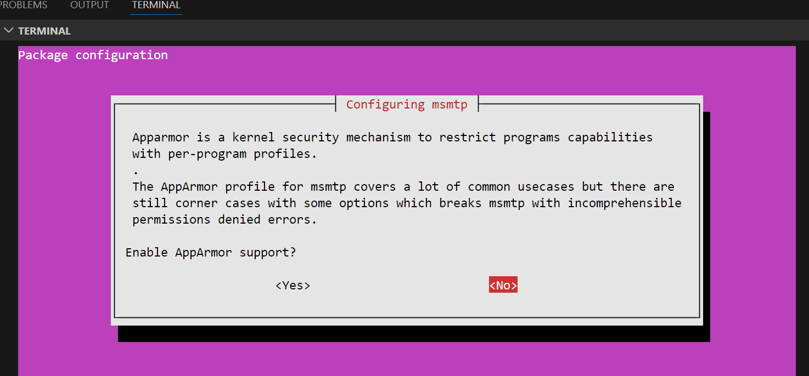

# SETUP 

## 0. Downloadovati private.key sa Discorda/Google drive-a

- Smestiti ga ovde pod imenom private.key

## 1. Dekriptovati credentials.txt.gpg, upotrebom private key-a 

gpg --import private.key
gpg --decrypt credentials.txt.gpg > credentials.txt

## 2. Proveriti da credentials.txt

Decrypted bi trebao da ima ovakav sadrzaj:

smtp_server=nesto 
smtp_user=nesto
smtp_pass="nesto"

## 3. Pokrenuti decrypt.sh

./decrypt.sh

- Ovo nam treba da bi se napravio .env fajl u ./email-util/.env


## 4. Uraditi setup python email client-a

```bash

cd email-util
chmod +x ./setup.sh
./setup.sh
```

## 5. Isprobati python email client-a

- **NAPOMENA**: Uvekidemo sa alerts-linux@rajak.rs kao primaocem mejla, posto rizikujemo SPAM reputaciju+probleme od GMAIL i drugih servera

 ./send-email.sh "alerts-linux@rajak.rs" "test" "body"

## 6. Ulogovati se na mail i proveritir da li se vidi u inboxu

- https://webmail.rajak.rs/
- Kredencijali u decrypted_credetials.txt


## 7. Pokrenuti python server

- cd ./zadatak/python-server
- start.sh

- Otvoriti chrome na lokaciji http://localhost:5000/health
- Odgovor servera bi trebao da bude: 
```json
{
  "status": "healthy"
}
```

## 8. Pokrenuti config skriptu 

```bash
 cd ./zadatak
 ./configure.sh
```

- Ovo ce prekopirati sadrzaj folder "libovi" u ~/lib-za-bash i dodati taj folder u PATH
- Ovo nam omogucava da skripte iz tog foldera sourcujemo u nasim zadacima

## 9. Pokrenuti test.sh da se potvrdi da sve radi

```bash
    cd ./zadatak
    ./test.sh
```
- Ocekivani output:

```bash
INFO  ==> test info
WARN  ==> test warn
ERROR  ==> test error
Health check passed: 200
INFO  ==> Initial health check succeeded.
```


# WSL network-specific errors i bindings za ipv6 jako otezavaju pricu

## Pristup sa cistim WSL odbacen posto su ipv6 socket libovi nefunkcionalni


## 1. Instalirati MSMTP, bez AppArmor


sudo apt-get install msmtp msmtp-mta



## 2. Dekriptovati credentials.txt.gpg, upotrebom private key-a 

gpg --import private.key
gpg --decrypt credentials.txt.gpg > credentials.txt


### prethodno su encrypted bili sa public.key

gpg --import public.key
gpg -e -r 'sebastian.rtrk.novak@gmail.com' credentials.txt


### ALATI za debug

- provera konekcije
```
openssl s_client -starttls smtp -connect sebastian.rajak.rs:465
```
trebalo bi da ispise CONNECTED(00000003)

- Povecanje timeout-a
Editovati ./config-msmtp.sh
```bash
logfile        ~/.msmtp.log
timeout 20 # POVECATI TIMEOUT
EOF
```


### Disable IPV6 upotrebu


:26...ying mail.rajak.rs
:26:Error connecting to mail.rajak.rs
***     IO::Socket::INET6: getaddrinfo: Name or service not known

```bash

sudo nano /etc/sysctl.conf
net.ipv6.conf.all.disable_ipv6 = 1
net.ipv6.conf.default.disable_ipv6 = 1
net.ipv6.conf.lo.disable_ipv6 = 1
```

### Naterati resolve

dig +short mail.rajak.rs A


